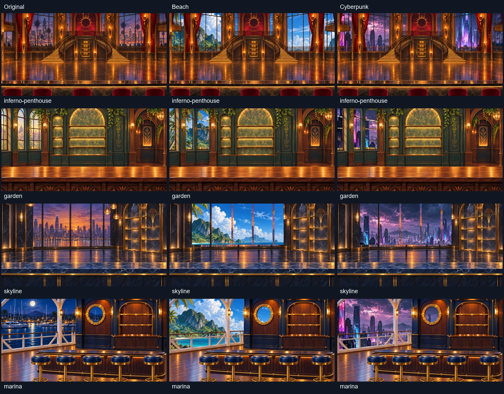

# Модульные бары и сменные пейзажи

Готовы и подключены все 74 модульные сцены. У 67 сцен с окнами или открытыми балконами вид снаружи отделён от архитектуры. Семь закрытых помещений не имеют наружного проёма.

Это завершение модульного разделения комнат. Перенос всех 67 исходных видов в общий выбор самостоятельных панорам ещё не завершён: [текущее состояние расширения](original-scenery-expansion.md).

В «Customize → Backgrounds → View outside» можно выбрать исходный вид комнаты или один из 12 отдельных пейзажей. Рамы, стойки и перила остаются частью комнаты. Смена видна в игре и в предпросмотре оформления.

## Файлы

- Рабочие слои: `public/assets/bar/modular/<scene>/`, включая `composite-ready/`.
- Сменные пейзажи: `public/assets/bar/exteriors/`.
- План, состояние и ссылки на наборы промптов: [общий пакет](../../scripts/modular-generation-batch-2026-10-07-all.json).
- Полные промпты пейзажей и исходники: [пакет пейзажей](../../scripts/modular-exterior-generation-batch-2026-10-07.json).
- [Проверка проёмов всех 74 сцен](exterior-validation.json): ошибок нет; пол непрозрачен; маска проёма согласована с архитектурой.

Графика создана встроенным ImageGen. Экспорт, упаковка слоёв и проверочные композиции выполнены локально. CLI/API генерация не использовалась. Для 56 архитектур применены новые прозрачные варианты; для 11 остальных открытых сцен использованы размеченные проёмы готовой графики.

## Проверки

16 целевых тестов пройдены. Проверка TypeScript, клиентская и серверная сборки пройдены. В браузере проверен выбор пляжа за окнами пентхауса с сохранением рам и перил. Полный список сцен доступен в общем пакете.
