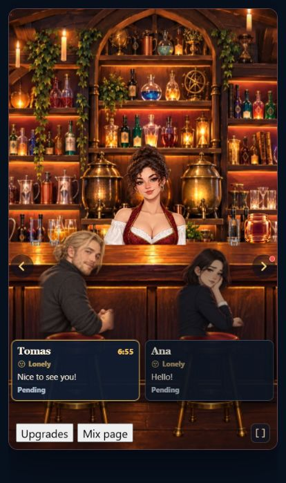
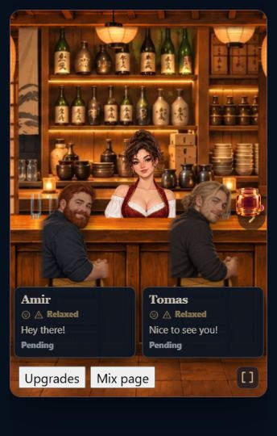

# Portrait bar layout

The runtime BarScene uses a separate composition below 760 px when its height/width ratio is at least 1.05. Architecture and exterior retain a matching cover crop. Furniture is placed independently with its original proportions.

Shelves and decorative bottle bays share one transform. The counter's measured upper surface defines the bartender and tip jar line. Two foreground cushions define guest positions; fewer requested seats are respected. Guest cards reserve 144 px above the bottom of the scene for readable cards and tools. Guest paging snaps to complete seat positions.

The visible shelf base meets the counter; transparent margins do not affect this anchor. Shelf scale uses visible furniture height, with outer bays allowed to continue past the screen edges. The counter retains its height down to the floor and crops its wide ends instead of shrinking its entire front into a narrow strip.

Bottles use the upper plank edge sampled near each reviewed marker in the actual shelf image. Images and sampled pixels are cached. Upright bottles share a row height, narrow bays reduce their count to keep gaps, and the selected pattern repeats across every physical shelf row.

Original room arrangement is the default when no bottle preset was explicitly selected. It reuses preserved shelf fragments for 73 rooms, restoring their original glasses, vessels, plants, books and bottles. Velvet retains its existing original bottle set. Generic bottles are not painted over these fragments. The exterior alpha mask removes scenery inside window openings so the outdoor background remains selectable. Existing transparent glassware also sits on the counter.

Original arrangements use up to 49% of portrait height for the visible shelves; alternate bottle arrangements use 40%. Both retain the same counter anchor. Counters, seats and exteriors remain separate modules, and alternate bottle presets remain selectable.

Furniture bounds are measured from installed alpha masks. Chairs with backs have reviewed cushion anchors; backless stools use the upper cushion instead of the footrest. Rebuild measurements with:

```powershell
node --import ./tests/register.mjs scripts/export-modular-registry.mjs | python scripts/measure-mobile-bar-art.py
```

Garden and Skyline use the existing Velvet stool for their portrait foreground because their original manifests have no separate seat layer. Desktop compositions retain their original layouts.

Validation: all 74 production rooms at 320×480, 360×640, 390×760 and 430×640; live BarScene checks for Harry Potter and Izakaya, including guest paging. The screenshot below uses the real component with local fixture guests.




